## About me

- Product Infrastructure team
- Joined Notion in 2019 (7 engineers)
- Left in late 2021 to focus on PhD
- Returned late 2022, balancing both (poorly)

## My relationship to TypeScript

- Complex
- Long-lived
- Deeply antagonistic

## TypeScript vs. other type systems

- Popular
- More expressive
- More dangerous

# Problem: all existing resources are bad.

# Background

## Why was TypeScript created?

> To migrate **large**, **untyped** enterprise codebases

## Legacy JavaScript

```js
var OrderProcessor = (function() {
    var total = 0;
    for (var i = 0; i < order.items.length; i++) {
        var item = order.items[i];
        var product = inventory[item.id];
        if (product && product.stock >= item.qty) {
            total += item.qty * product.price;
            product.stock -= item.qty;
        }
    }
    // ...
})();
```

## This isn't how Notion uses TypeScript!

We are not 2015-era Microsoft/Google/Facebook

## Then vs. now

::: columns
::: column
- Code starts **untyped**
- Priority is **preserve existing behavior**
- Escape hatches **no worse** than baseline
:::

::: column
- Code starts **typed**
- New code should be written **using typed idioms**
- Escape hatches **much worse** than baseline
:::
:::

## Escape hatches?

- **Cop-out type**: `any`
- **Pragmas**: `@ts-ignore`
- **Flags**: `--suppressImplicitAnyIndexErrors`

## Escape hatches, cont.

- **Casts**: `x as Foo`
- **Type guards**: `f(x: unknown): x is Foo`
- **Overloads**

    ```ts
    function getEnd(d: Date): undefined
    function getEnd(d: DateRange): Date
    function getEnd(d: Date | DateRange) {
        ...
    }
    ```

## How Notion uses TypeScript

- As a **fully-typed language**
- With the benefits of the JavaScript ecosystem
- Helps us write correct programs
- *TypeScript: The Good Parts*

# Foundations

- Types vs. values
- Structural subtyping

## Types vs. values

---

<!-- Example 1 -->

::: columns
::: column
### Types

```ts
type Env =
    | "local" 
    | "dev" 
    | "stg" 
    | "prod"
```
:::

::: column
### Values
```ts
const env = [
    "local",
    "dev",
    "stg",
    "prod"
]
```
:::
:::

## Sometimes, it's more confusing...

```
'code' refers to a value, but is being used as a type here. Did you mean 'typeof code'? (2749)
```

---

<!-- Example 3 -->

::: columns
::: column
### Types

```ts
type Config = {
    local: {
        db: "spaceShard001",
    },
    dev: {
        db: "spaceShard008",
    }
}
```
:::

::: column
### Values

```ts
const config = {
    local: {
        db: "spaceShard001",
    },
    dev: {
        db: "spaceShard008",
    }
}
```
:::
:::

## Taking a step back: static vs. dynamic

---

<!-- Comparison -->

::: columns
::: column
### Static

- Compile/build-time
- Parsing, linting, typechecking
- Type/lint errors
:::

::: column
### Dynamic

- Runtime
- Evaluation, execution
- Exceptions/crashes
:::
:::

. . .

::: columns
::: column
> "expectation"
:::

::: column
> "reality"
:::
:::

. . .

<span style="position: absolute; top: 1.5em; left: 50%; transform: translateX(-50%) translateY(-50%); color: #cc0909cf;"><em>approximates</em></span>


---


::: columns
::: column
### Static

- Compile-time
- Parsing, linting, typechecking
- Type/lint errors
- **Types**
:::

::: column
### Dynamic

- Runtime
- Evaluation, execution
- Exceptions/crashes
- **Values**
:::
:::

<span style="position: absolute; top: 1.5em; left: 50%; transform: translateX(-50%) translateY(-50%); color: #cc0909cf;"><em>approximates</em></span>

. . .

> **Types** approximate **values**.

## How close is the approximation?

## Java: not that close

| Value | Closest type (Java) |
|-|-|
| `"hello"` | String |
| `true` | boolean |
| `1` | int |

## TypeScript: pretty close!

| Value | Closest type (TS) | Closest type (Java) |
|-|-|-|
| `"hello"` | `"hello"` | String |
| `true` | `true` | boolean |
| `1` | `1` | int |

## Type-level vs. value-level

```ts
export const BlockTable = "block"
export type BlockTable = "block"
```

```ts
import { BlockTable } from "./schemas/Block"
import type { BlockTable } from "./schemas/Block"
```

## Type-level vs. value-level

```ts
export const BlockTable = "block"
export type BlockTable = typeof BlockTable
```

```ts
import { BlockTable } from "./schemas/Block"
import type { BlockTable } from "./schemas/Block"
```

## `typeof`: Value → Type

```ts
export const BlockTable = "block"
export type BlockTable = typeof BlockTable
```

. . .

> dependent types

## Syntactic restrictions

```
'code' refers to a value, but is being used as a type here. Did you mean 'typeof code'? (2749)
```

---

## Syntactic restrictions

<!-- Example 2 -->

::: columns
::: column
### Types

```ts
const x: ____ = "foo"

x satisfies ____
```
:::

::: column
### Values
```ts
const x: Foo = ____

____ satisfies Foo
```
:::
:::

## TypeScript = structural subtyping

## Subtyping

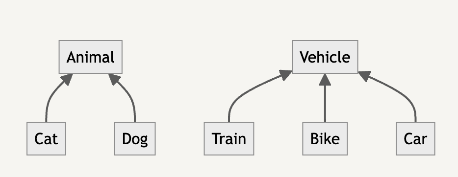
<!-- ```mermaid -->
<!-- graph BT -->
<!-- 	Cat & Dog -1-> Animal -->
<!-- ``` -->

<!-- ```mermaid -->
<!-- graph BT -->
<!-- 	Train & Bike & Car -1-> Vehicle -->
<!-- ``` -->

<!-- ```mermaid -->
<!-- graph BT -->
<!-- 	ImageBlock & TodoBlock & DividerBlock -1-> Block -->
<!-- ``` -->

## Liskov substitution principle

> Can you replace type `Foo` with `Bar`, **without breaking the program**?

. . .

→ `Bar` is a subtype of `Foo`

. . .

→ `Bar` $<:$ `Foo`

## Liskov substitution principle

> Can you replace type `Block` with `TodoBlock`, **without breaking the program**?

→ `TodoBlock` is a subtype of `Block`

→ `TodoBlock` $<:$ `Block`

## Example: `TodoBlock` $<:$ `Block`

::: columns
::: column
```ts
type Block = {
    id: string,
    alive: boolean,
}
```
:::
::: column
```ts
function isAlive(
    block: Block
): boolean {
    return block.alive
}
```
```ts
isAlive(block)
```
:::
:::

## Example: `TodoBlock` $<:$ `Block`

::: columns
::: column
```ts
type Block = {
    id: string,
    alive: boolean,
}

type TodoBlock = Block & {
    checked: boolean,
}
```
:::
::: column
```ts
function isAlive(
    block: Block
): boolean {
    return block.alive
}
```
```ts
isAlive(todoBlock)
```
:::
:::

. . .

*Intuition:* `TodoBlock` provides **at least as much** information as `Block`

<!--
## `Assert` type

```ts
import { type Assert } from "@notionhq/shared-utils/typeUtils"

type _A1 = Assert<Block, TodoBlock> // TodoBlock <: Block
```

(I think it's confusing that this is backwards)
-->

## *Structural* subtyping

## We know this works:

::: columns
::: column
```ts
type Block = {
    id: string,
    alive: boolean,
}

type TodoBlock = Block & {
    checked: boolean,
}
```
:::
::: column
:::
:::

```ts
const todoBlock: TodoBlock = { 
    id: "todo1",
    alive: true,
    checked: false,
}

todoBlock satisfies Block // ✅ Works!
```

## What if we inline everything from `Block`?

::: columns
::: {.column style="opacity: 50%;"}
```ts
type Block = {
    id: string,
    alive: boolean,
}

type TodoBlock = Block & {
    checked: boolean,
}
```
:::
::: column
```ts
type Block = {
    id: string,
    alive: boolean,
}

type TodoBlock = {
    id: string,
    alive: boolean,
    checked: boolean,
}
```
:::
:::

. . .

```ts
declare const todoBlock: TodoBlock

todoBlock satisfies Block // ✅ Still works!
```


## Structural subtyping

**Nominal** subtyping (Java, C++): based on explicit declarations/names.

**Structural** subtyping (TypeScript): based on shape and contents.

## Analogy: Group chats

## Corollary 

> Type aliases are for human benefit!

## Quiz: Which is the subtype?

::: columns
::: column
```ts
type A = {
    foo: string,
    bar: number,
}
```
:::
::: column
```ts
type B = {
    foo: string,
}
```
:::
:::

. . .

> Answer: `A` is a subtype of `B`

## Quiz: Which is the subtype? 

::: columns
::: column
```ts
type TodoBlock = {
    id: string,
    checked: boolean,
}
```
:::
::: column
```ts
type Block = {
    id: string,
}
```
:::
:::

> Answer: `TodoBlock` is a subtype of `Block`

## Why is this unintuitive?

::: columns
::: column
```ts
// Sub
type A = {
    foo: string,
    bar: number,
}
```
:::
::: column
```ts
// Super
type B = {
    foo: string,
}
```
:::
:::

Shouldn't `B` be the **subtype**, since it's a **subset** of properties?

. . .

> A valid **subtype** must contain a **superset** of fields.

. . .

(because the subtype is **more specific**!)

## Object subtyping is tricky—double-check your intuition!

## Width rules


## Depth rules


## Depth example

::: columns
::: column
```ts
type Experiment = {
    id: string,
    env: "local" 
       | "dev" 
       | "stg" 
       | "prod",
}
```
:::
::: column
```ts
type RiskyExperiment = {
    id: string,
    env: "local" 
       | "dev",
    endDate: Date,
}
```
:::
:::

`RiskyExperiment` can apply to a **subset** of environments.

## Subtyping visualization

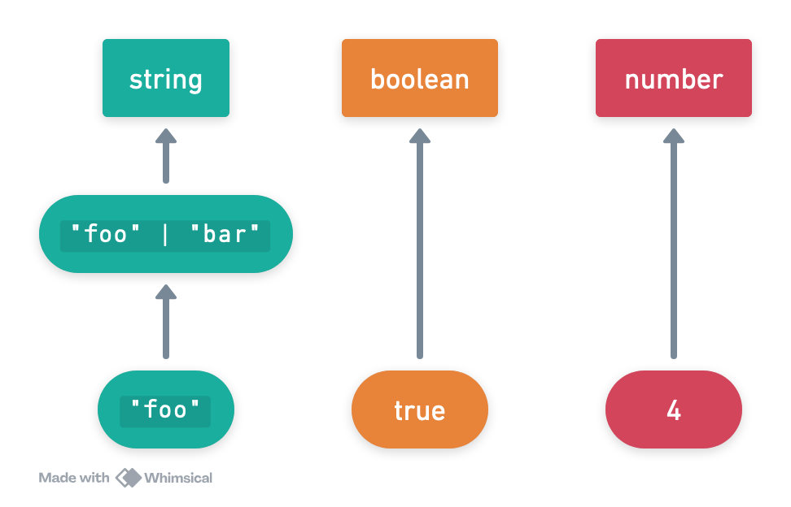

# Type refinements/narrowing: a quick review

## Example: Blocks to text

::: columns
::: column
```ts
// Base type.
type BlockBase = {
    id: string,
    alive: boolean,
}
```
:::
::: column
```ts
// Subtypes.
type TodoBlock = BlockBase & {
    checked: boolean,
}

type ImageBlock = BlockBase & {
    src: string,
    caption: string
}

type DividerBlock = BlockBase
```
:::
:::

## How should we write this function?

```ts
function toPlainText(block: Block): string {
    // TodoBlock    -> "[x]" vs. "[ ]"
    // ImageBlock   -> caption
    // DividerBlock -> "--------------"
}
```

# Myth: `any` means "all possible types"

---

### Subtyping directed acyclic graph (DAG)

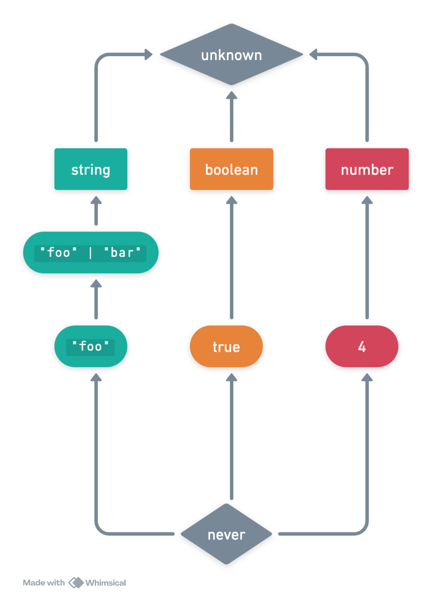{width=600px}

---

### Path in DAG = subtype

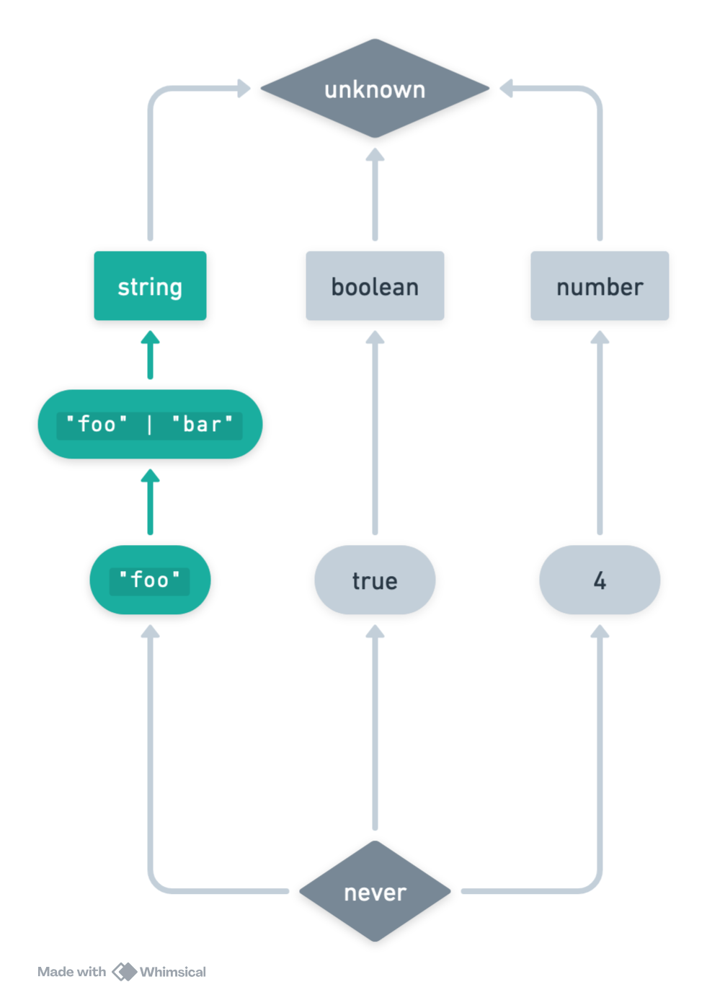{width=600px}

---

### Is `true` a subtype of `string`?

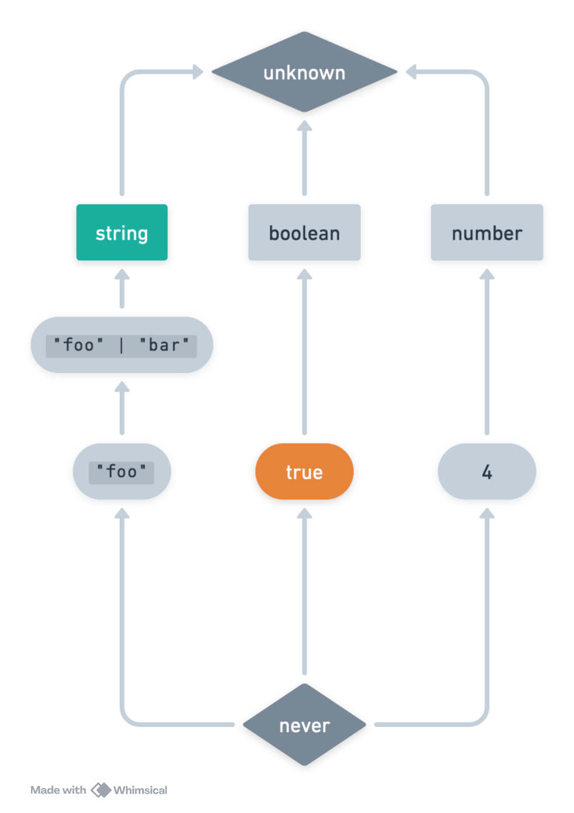{width=600px}

---

### Is `true` a subtype of `string`?

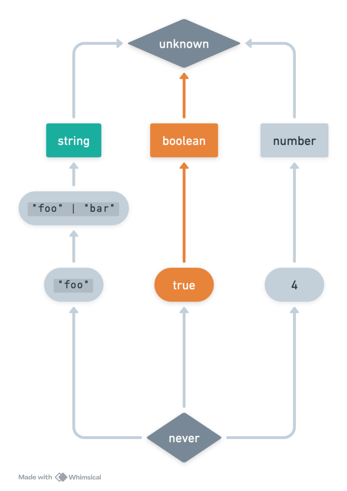{width=600px}

---

### Is `true` a subtype of `string`?

No.

---

### Curse of `any`

{width=600px}

---

### `any` at the top…and bottom

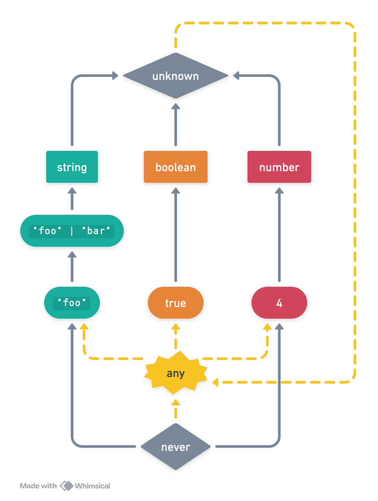{width=600px}

---

### There is a cycle!

{width=600px}

---

### Is `true` a `string`?

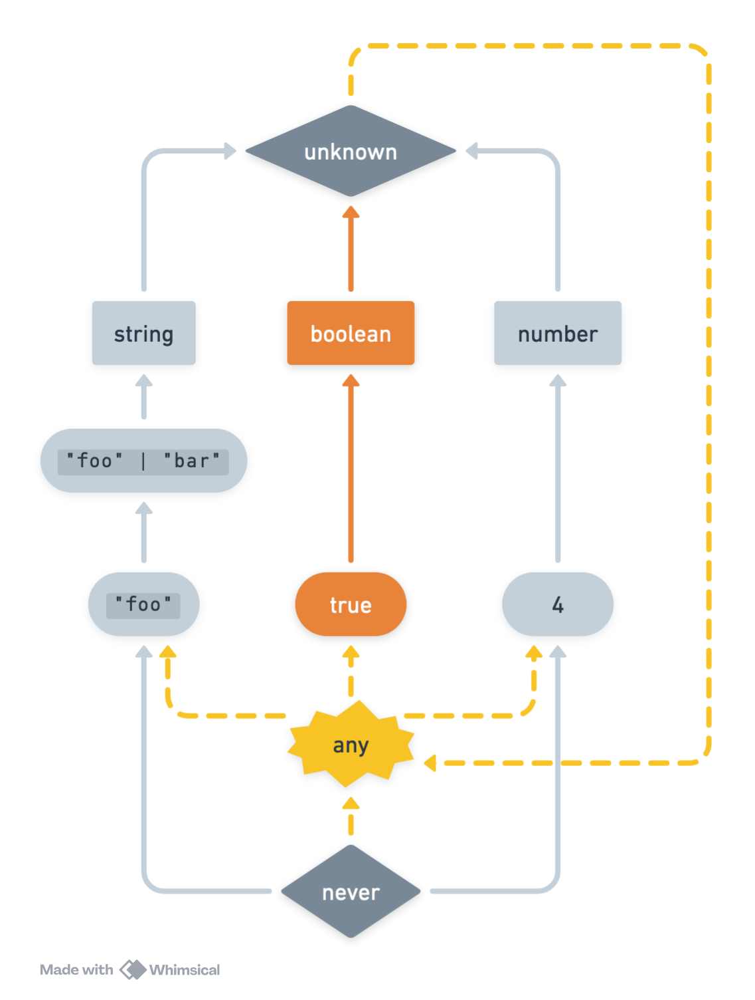{width=600px}

---

### We can get past `unknown`...

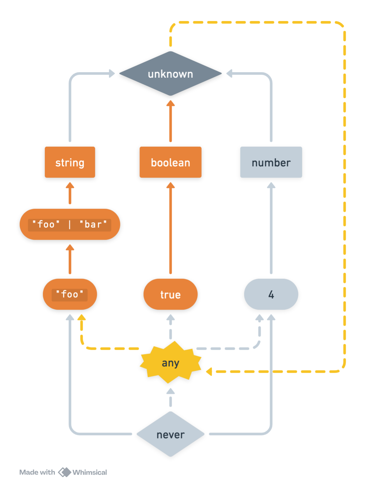{width=600px}

---

### Oops

{width=600px}

---

### Oops

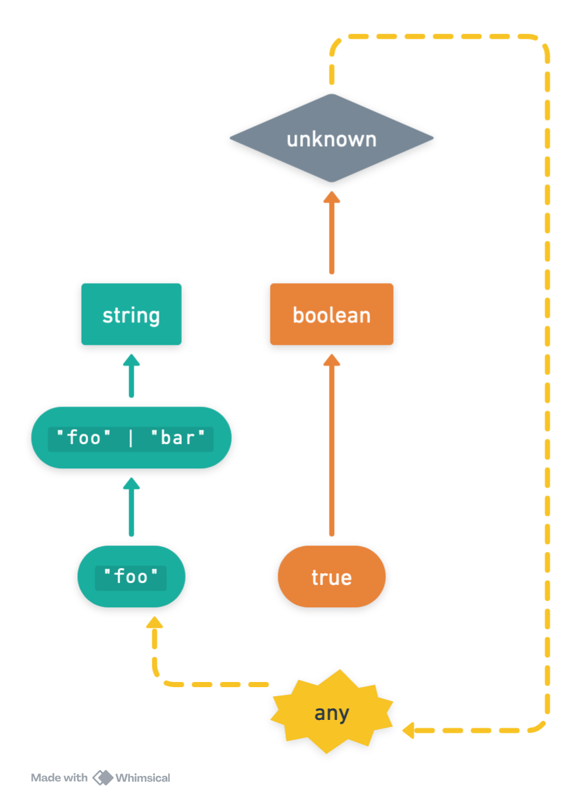{width=600px}

## Lest you think I am exaggerating

```ts
const _true = true
const _bool: boolean = _true
const _haha: any = _bool
const _foo: "foo" = _haha
const _fooOrBar: "foo" | "bar" = _foo
const _string: string = _fooOrBar
```

## Good news: one easy trick

> Replace `any` with `unknown`!

. . .

- Works 85% of the time, for free
- Doctors hate her
- Not sure why this isn't publicized more

## `unknown` is the true "top" type

{width=600px}

## What about `never`?

{width=600px}

## Example: Blocks to text

```ts
function toPlainText(block: TodoBlock | ImageBlock | DividerBlock): string {
    if (block.type === "todo") {
        return block.checked ? "[x]" : "[ ]"
    } else if (block.type === "image") {
        return block.caption
    } else {
        // DividerBlock -> 
        return "--------------"
    }
}
```

# Make invalid states unrepresentable

---

## API status: optional soup

```ts
type ApiResponse = {
    type: "error" | "loading" | "success",
    error?: Error,
    data?: string,
}
```

## API status: discriminated union

```ts
type ApiResponse = {
    type: "error",
    error: Error
} | {
    type: "success",
    data: string
} | {
    type: "loading",
    data?: string,
}
```

## Refinements

```ts
declare const r: ApiResponse 

if (r.type === "error") {
    r.error
} else if (r.type === "success") {
    r.data satisfies string
} else if (r.type === "loading") {

} else {
    r satisfies never
}
```

# Thanks!

Come to **TypeScript 201** next Friday if you want more

# Miscellaneous stuff if time

# Cultural practices

## A normal day on the internet


## Top answer: jUst cASt

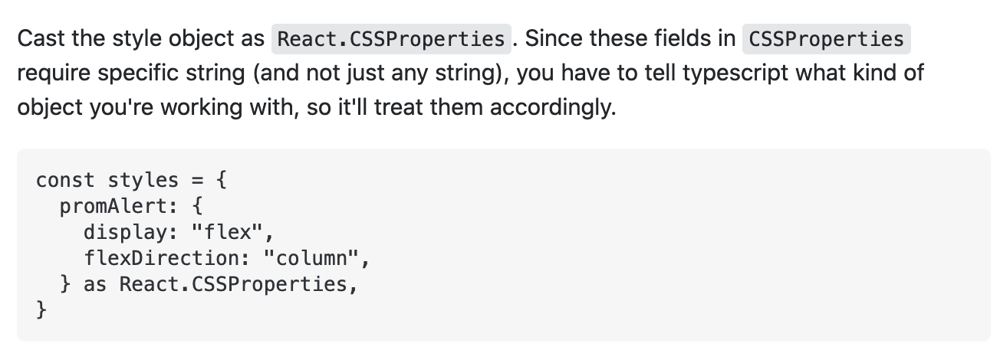

## Another [normal question](https://stackoverflow.com/questions/42066421/property-value-does-not-exist-on-type-eventtarget)

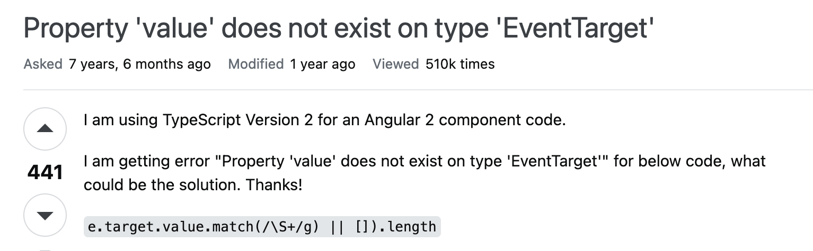
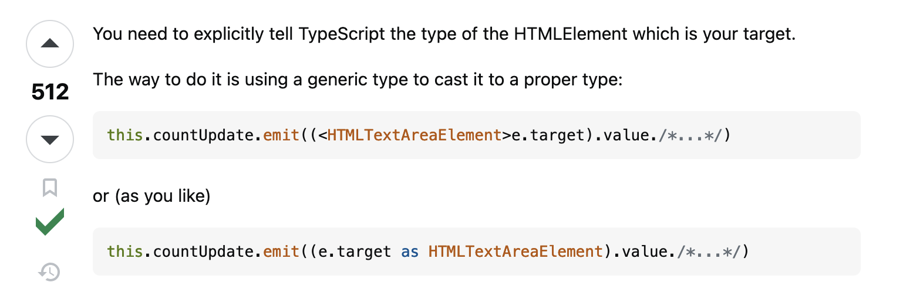


# Adding union types to DAG

## How to introduce a union type?

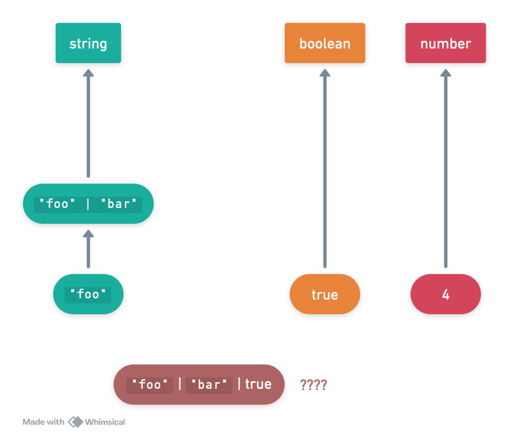

## Draw incoming edges (subtypes)

{width=800px}


## Draw outgoing edges (supertypes)

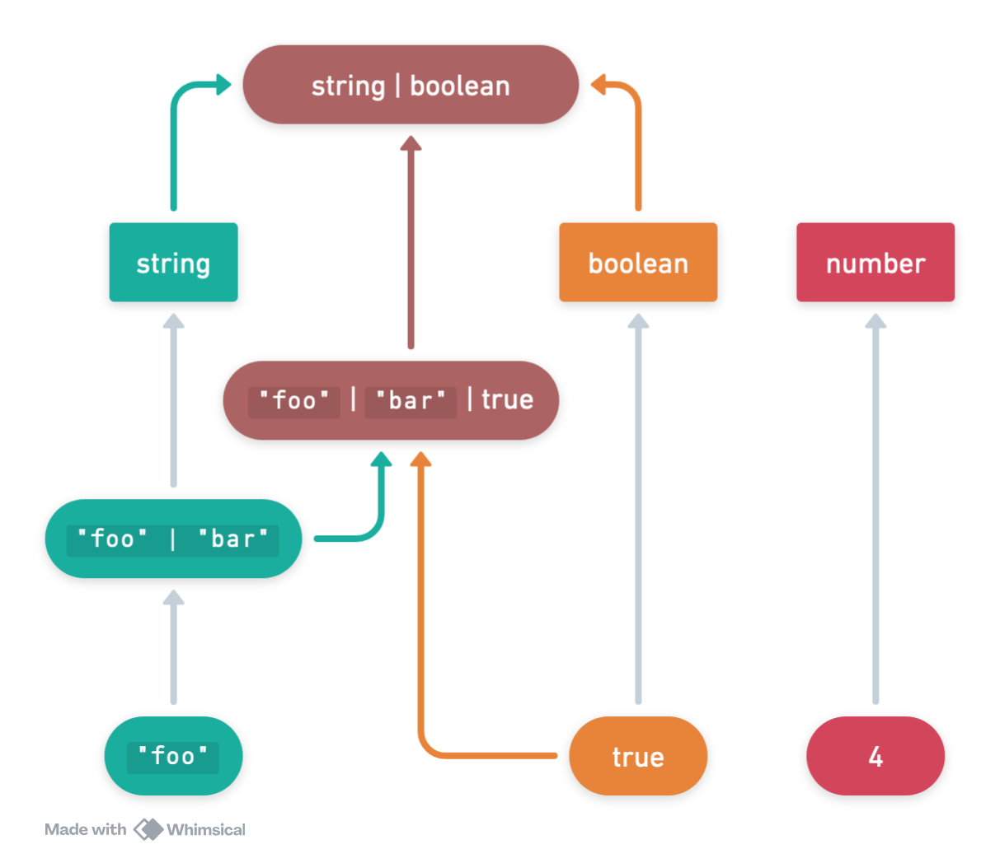{width=800px}


## Finished

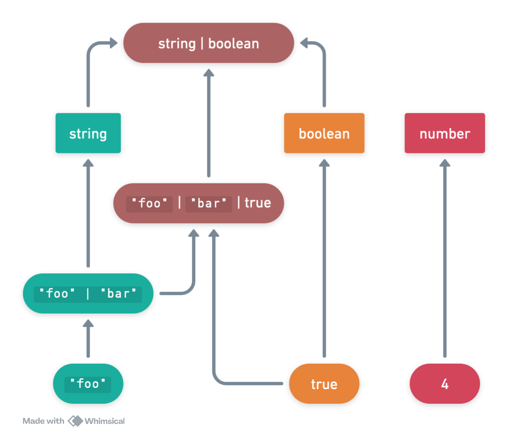{width=800px}


<!-- ## Myth: your goal is to make the type error go away -->

<!-- ## Myth: boolean maps are a good way to model types -->
